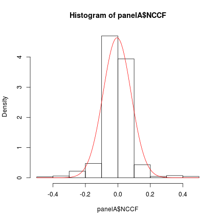
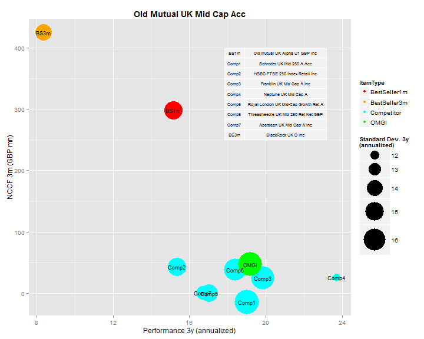
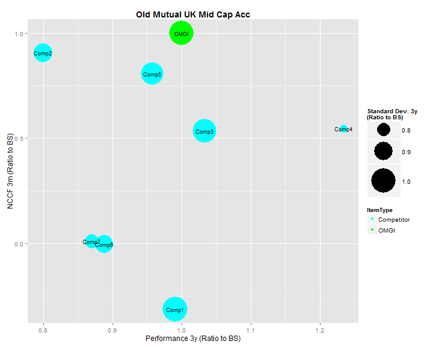
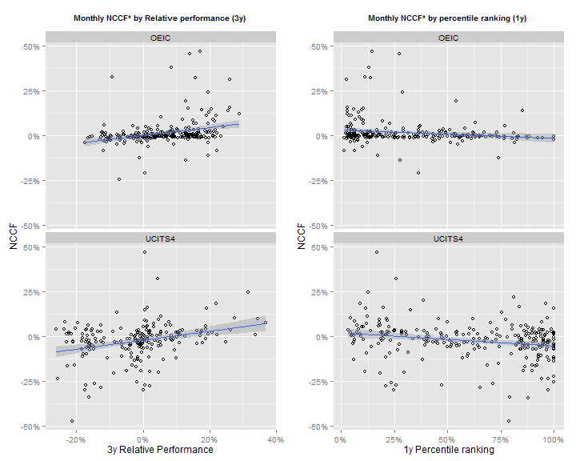
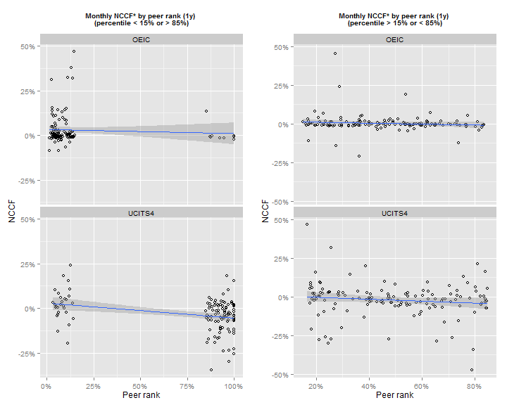
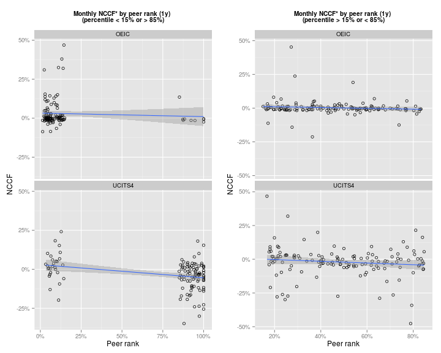

# Performances and funds NCCF: a data based analysis
_Matteo Castagna (Nov/2013) - OMGI Investment Risk & Performance / v.1.0_
> This paper has been created entirely with *R* language and environment (a GNU project - available as Free Software)
Raw data are stored and retrieved from a SQLServer dBase. 
The added *R* packages used are listed below.

> The entire analysis is reproducible and embedded in the paper itself at runtime.


```r
library(ggplot2)
library(knitr)
library(scales)
library(car)
library(grid)
library(gridExtra)
library(zoo)
```

```
## 
## Attaching package: 'zoo'
## 
## The following objects are masked from 'package:base':
## 
##     as.Date, as.Date.numeric
```

```r
library(bdsmatrix)
```

```
## 
## Attaching package: 'bdsmatrix'
## 
## The following object is masked from 'package:base':
## 
##     backsolve
```

```r
library(nlme)
library(Formula)
library(MASS)
library(sandwich)
library(plm)
```


### Introduction and summary

A large portion of our time is focused on analysing and making sure funds perform "well". But are fund performances a key factor determining their success? Or is it something else driving it?

My starting point is that a commercially successful product is a product that sells. A fund that performs well (however you want to measure this: in absolute terms, vs. a reference index or vs. peer group) but doesn't sell is not a success. 

The objective of an asset management company is to sell as many of their fund as they can using scalable operations (i.e. without incurring in excess operational costs).
Sure there are management fees that needs to be accounted for as well; but the focus of this analysis are retail products, not mandates or Hedge Funds.
Retail products only rarely command performance fees [1]. 

This papers demonstate that there is a very weak statistical relationship between a fund performance and the net client cashflows (NCCF - the difference between subscriptions and redemptions).
That is: there is no clear relationship between the fund manager success in terms of fund returns (using all possible different measures) and its commercial success (as measured by the increase of AuMs).

### Method

The _IR&P_ team has developed a substantial dataset that enable proper data analysis: this paper is based on two data panels:

- Panel A - covering the entire set of OMGI funds/mandates over the last 10 months (Jan/2013 to Oct/2013) 

```
## [1] "Raw number of products: 122"
```

```
## [1] "Observations: 1079"
```


- Panel B - covering typically the bigger OMGI retail funds alongside up to 7 competitors (as defined by the _product_ unit) and "two bestsellers" (over the last 1m and 3m , as sourced from Morningstar) observed between Apr/2013 and Oct/2013. 


```
## [1] "Raw number of products: 15"
```

```
## [1] "Observations: 653"
```


Panel A is used to analyse the impact of different measures of performance on the monthly NCCF. 
The performance measures used are
- absolute 
- relative
- sector percentile ranking 
over 1m, 3m, 6m, 1y, 2y, 3y. 
The analysis considered as well the 1m and 3m lagged performance variables by 1, 2, and 3 periods (that is the effect on NCCF from the performance variables 1, 2 and three months before).
When more data will be available further lags will be considered.

Panel B is used to assess how important is the 1y and 3y relative performance (relative to the best sellers) to explain the 1 or 3 months NCCF ratio vs. the best seller NCCF in the peer group.
Using Panel B enables us to explore beyond the OMGI world.

#### Panel A data management
The raw dataset for Panel A consists in official performance data (as collected on a monthly basis from Morningstar) and NCCF estimates computed by _IR&P_ based on the following: 

$$
NCCF(t) = \frac{NCCF_i(t-1, t)}{AuM_i(t-1)} =\left(\frac{AuM_i(t)}{AuM_i(t-1)} - 1\right) - {Perf_i(t-1, t)}
$$ 

that is the percent change of AuMs for the product _i_ between _t-1_ and _t_ due to only to subscriptions and redemptions is equal to the percentage change of the fund AuMs less the fund performance over the same period.
What we are doing with that measure is to get rid of the increase of AuM in the fund due to the performance of the fund itself which is liked to the market movements and/or _alpha_ delivered by the activity of the fund manager.

Few tweaks are applied to the dataset in order to get rid of outliers (notably the SKPROP fund is showing wild performance swings because of a) how the fund is priced and b) how difficult is to get hold of the benchmark data) and observations belonging to products not actually marketed (i.e. using seed capital).


```
## [1] "Outliers with |NCCF| > 50%: 17"
```

```
## [1] "Excluded funds: SKPROP"
```

```
## [1] 10
```

```
## [1] "Seeded Select funds obs.: 154"
```

```
## [1] "Final number of products: 76"
```

```
## [1] "Final number of observations: 898"
```


The end result is the data set for panel A used for numerical and graphical analysis.

The distribution of the NCCF in the sample is as follows:

 


#### Panel B data management

Data are again sourced from Morningstar and the criteria for their collection is based on the definition of a restricted set of competitors for the relevant OMGI funds as defined by the _Products_ unit.
The focus in this case is about assessing how the performance-NCCF relationship works outside the OMGI set of products.
NCCF is now provided by Morningstar and it's not based on _IR&P_ estimates.
The basic dataset is the same as the one used for the regular monthly updates

 


The transformations applied are as follows:
- the best sellers have been dropped: there are instances where they are already included in the competitors set and their distance from the proper set is typically quite big making them not so useful for the analysis
- Once BS are dropped, the Ratio of NCCF of each fund vs. highest NCCF over 1 or 3 months (NCCF1mGBPmn and NCCF3mGBPmn) is computed (giving RatioToBS1m and RatioToBS3m) [this is dealt with at SQL level]
- The performance of the funds (1y and 3y) are then divided by the performance of the best seller over 1m and 3m (giving Perf1y1mRatio, Perf3y1mRatio and perf1y3mRatio, perf3y3mRatio)  [this is dealt with at SQL level]
- outliers are removed (outliers defined by |RatioToBS1m| or |RatioToBS3m| > 10 and |PeformanceRatios| > 3) 
- The group of funds observations where the number of competitors in the sample with valid data is less than 2 is dropped as well.

The variables available for Panel B are:


```
##  [1] "ItemId"         "RatioToBS1m"    "RatioToBS3m"    "Perf1y1mRatio" 
##  [5] "Perf3y1mRatio"  "StDev1y1mRatio" "StDev3y1mRatio" "Perf1y3mRatio" 
##  [9] "Perf3y3mRatio"  "StDev1y3mRatio" "StDev3y3mRatio" "NCCF1mGBPmn"   
## [13] "NCCF3mGBPmn"    "Perf1y"         "Perf3y"         "StDev1y"       
## [17] "StDev3y"        "CompNo"         "FundId"         "RefDate"       
## [21] "FundName"       "Sector"         "ItemType"
```


The equivalent of chart above based this time on the NCCF, Performance and Volatility ratios would then be:

 


Interpreting that chart (i.e. the ratio numbers) is intuitive as well: what the chart is showing as an example is that while Comp4 returned more than 20% on top of what the best seller (OMGI) did over the last three months, the NCCF is about 54% of that fund.


```
##     ItemId RatioToBS3m Perf3y3mRatio StDev3y3mRatio
## 575  Comp1   -0.312910        0.9906         1.0085
## 576  Comp2    0.907579        0.7995         0.8934
## 577  Comp3    0.537005        1.0333         0.9945
## 578  Comp4    0.548585        1.2339         0.7118
## 579  Comp5    0.808143        0.9573         0.9781
## 580  Comp6   -0.003593        0.8880         0.8818
## 581  Comp7    0.011181        0.8698         0.8184
## 583   OMGI    1.000000        1.0000         1.0000
```


### Results


####Panel A analysis
 


 


####Panel B analysis
 


### Conclusions

### References

[1] in the OMGI case we only have _UKDEFOS_, _GEAR_, _UKOPP_ and _SKMFUT_


