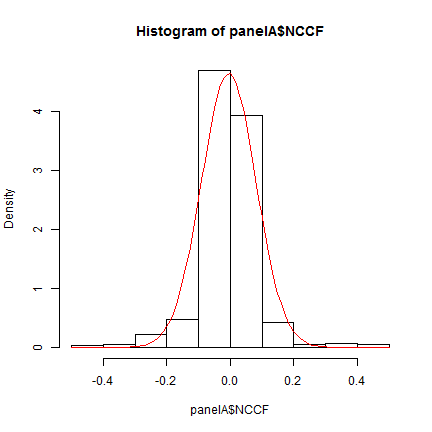
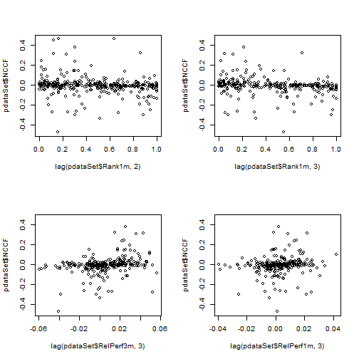

# Retail funds performance and Net Client Cash-Flows: a data based analysis
_Matteo Castagna (Nov/2013) - OMGI Investment Risk & Performance / v.1.1_
> This paper has been created entirely with *R* language and environment (a GNU project - available as Free Software).  
Raw data are stored and retrieved from a SQLServer dBase. The added *R* packages used are listed below.  
The entire analysis is reproducible and embedded in the paper itself at runtime.  
All the relevant material is available as a Git repo at https://githib.com/mcastagnaa/PerfNCCF  


```r
library(ggplot2)
library(knitr)
library(scales)
library(car)
library(grid)
library(gridExtra)
library(zoo)
library(bdsmatrix)
library(nlme)
library(Formula)
library(MASS)
library(sandwich)
library(plm)
```


### Introduction and summary

A large portion of our time is spent analysing and making sure funds perform "well". But are fund performances a key factor determining their success? Or is it something else driving it?

My starting point is that a commercially successful product is a product that sells. A fund that performs well (however you want to measure this: in absolute terms, vs. a reference index or vs. peer group) but doesn't sell is not a success. 

The objective of an asset management company is to sell as many of their fund as they can using scalable operations (i.e. without incurring in excess operational costs).

Sure there are management fees that needs to be accounted for as well; but the focus of this analysis are retail products, not mandates or Hedge Funds.
Retail products only rarely command performance fees. 

This papers demonstrate that there is a very weak statistical relationship between a fund performance and the net client cash-flows (NCCF - the difference between subscriptions and redemptions).
That is: there is no clear relationship between the fund manager success in terms of fund returns (using all possible different measures) and its commercial success (as measured by the increase of AuMs).

### Method

The _IR&P_ team has developed a substantial dataset that enable proper data analysis: this paper is based on two data panels:

- Panel A - covering the entire set of OMGI funds/mandates over the last 10 months (Jan/2013 to Oct/2013) 

```
[1] "Raw number of products: 122"
```

```
[1] "Observations: 1079"
```


- Panel B - considering the bigger OMGI retail funds alongside up to 7 competitors (as defined by the _Product_ unit) and "two best-sellers" (over the last 1m and 3m , as sourced from Morningstar). This is observed between Apr/2013 and Oct/2013. 


```
[1] "Raw number of products: 15"
```

```
[1] "Observations: 653"
```


Panel A is used to analyse the impact of different measures of performance on the monthly NCCF. 
The performance measures used are
- absolute 
- relative
- sector percentile ranking 
over 1m, 3m, 6m, 1y, 2y, 3y. 
The analysis considered as well the 1m and 3m lagged performance variables by 1, 2, and 3 periods (that is the effect on NCCF from the performance variables observed 1, 2 and 3 months before).
When more data will be available further lags will be considered.

Panel B is used to assess how important is the 1y and 3y relative performance (relative to the best sellers) and volatility of returns to explain the 1 or 3 months NCCF ratio vs. the best seller NCCF in the peer group.
Using Panel B enables us to explore beyond the OMGI world.

#### Panel A data management
The raw dataset for Panel A consists in official performance data (as collected on a monthly basis from Morningstar) and NCCF estimates computed by _IR&P_ based on the following: 

$$
NCCF(t) = \frac{NCCF_i(t-1, t)}{AuM_i(t-1)} =\left(\frac{AuM_i(t)}{AuM_i(t-1)} - 1\right) - {Perf_i(t-1, t)}
$$ 

that is the percent change of AuMs for the product _i_ between _t-1_ and _t_ due to only to subscriptions and redemptions is equal to the percentage change of the fund AuMs less the fund performance over the same period.
What we are doing with that measure is to get rid of the increase of AuM due to the performance of the fund itself which is liked to the market movements and/or _alpha_ delivered by the activity of the fund manager.

Few tweaks are applied to the dataset in order to get rid of outliers (notably the SKPROP fund is showing wild performance swings because of a) how the fund is priced and b) how difficult is to get hold of the benchmark data) and observations belonging to products not actually marketed (i.e. using seed capital).


```
[1] "Outliers with |NCCF| > 50%: 17"
```

```
[1] "Excluded funds: SKPROP"
```

```
[1] "Excluded observations from excluded funds: 10"
```

```
[1] "Seeded Select funds obs.: 154"
```

```
[1] "Final number of products: 76"
```

```
[1] "Final number of observations: 898"
```


The end result is the data set for panel A used for numerical and graphical analysis.

The distribution of the NCCF in the sample is as follows:

 


#### Panel B data management

Data are again sourced from Morningstar and the criteria for their collection is based on the definition of a restricted set of competitors for the relevant OMGI funds as defined by the _Products_ unit.
The focus in this case is about assessing how the performance-NCCF relationship works outside the OMGI set of products.
NCCF is now provided by Morningstar and it's not based on _IR&P_ estimates.
The basic dataset is the same as the one used for the regular monthly updates

 


The transformations applied are as follows:
- the best sellers have been dropped: there are instances where they are already included in the competitors set and their distance from the rest is typically quite big making them not so useful for the analysis
- Once BS are dropped, the Ratio of NCCF of each fund vs. highest NCCF over 1 or 3 months (NCCF1mGBPmn and NCCF3mGBPmn) is computed (giving RatioToBS1m and RatioToBS3m) [this is dealt with at SQL level]
- The performance of the funds (1y and 3y) are then divided by the performance of the best seller over 1m and 3m (giving Perf1y1mRatio, Perf3y1mRatio and perf1y3mRatio, perf3y3mRatio)  [this is dealt with at SQL level]
- outliers are removed (outliers defined by |RatioToBS1m| or |RatioToBS3m| > 10 and |PerformanceRatios| > 3) 
- The group of funds observations where the number of competitors in the sample with valid data is less than 2 is dropped as well.

The variables available for Panel B are:


```
 [1] "ItemId"         "RatioToBS1m"    "RatioToBS3m"    "Perf1y1mRatio" 
 [5] "Perf3y1mRatio"  "StDev1y1mRatio" "StDev3y1mRatio" "Perf1y3mRatio" 
 [9] "Perf3y3mRatio"  "StDev1y3mRatio" "StDev3y3mRatio" "NCCF1mGBPmn"   
[13] "NCCF3mGBPmn"    "Perf1y"         "Perf3y"         "StDev1y"       
[17] "StDev3y"        "CompNo"         "FundId"         "RefDate"       
[21] "FundName"       "Sector"         "ItemType"      
```


The equivalent of chart above based this time on the NCCF, Performance and Volatility ratios would then be:

 


Interpreting that chart (i.e. the ratio numbers) is intuitive as well: what the chart is showing is that while _Comp4_ returned more than 20% on top of what the best seller (_OMGI_ in this case) did over the last three months, the NCCF is about 54% of that fund.


```
    ItemId RatioToBS3m Perf3y3mRatio StDev3y3mRatio
575  Comp1   -0.312910        0.9906         1.0085
576  Comp2    0.907579        0.7995         0.8934
577  Comp3    0.537005        1.0333         0.9945
578  Comp4    0.548585        1.2339         0.7118
579  Comp5    0.808143        0.9573         0.9781
580  Comp6   -0.003593        0.8880         0.8818
581  Comp7    0.011181        0.8698         0.8184
583   OMGI    1.000000        1.0000         1.0000
```


### Results


#### Panel A analysis

The analysis of panel A dataset explore the relationship between monthly performance data and the NCCF.

The starting point is an all-in regression where all the variable are thrown in.
Starting from there, a stepwise algorithm [2] is used to get to the best model.
The result is as follows:


```

Call:
lm(formula = NCCF ~ RelPerf3y + Rank1y, data = panelA, na.action = na.omit)

Residuals:
    Min      1Q  Median      3Q     Max 
-0.4074 -0.0270 -0.0028  0.0256  0.4672 

Coefficients:
            Estimate Std. Error t value Pr(>|t|)    
(Intercept)  0.00574    0.00832    0.69   0.4905    
RelPerf3y    0.20089    0.04216    4.76  2.5e-06 ***
Rank1y      -0.04077    0.01573   -2.59   0.0098 ** 
---
Signif. codes:  0 '***' 0.001 '**' 0.01 '*' 0.05 '.' 0.1 ' ' 1

Residual standard error: 0.0832 on 461 degrees of freedom
  (434 observations deleted due to missingness)
Multiple R-squared:  0.135,	Adjusted R-squared:  0.131 
F-statistic:   36 on 2 and 461 DF,  p-value: 2.89e-15
```

```
               2.5 %    97.5 %
(Intercept) -0.01060  0.022081
RelPerf3y    0.11803  0.283738
Rank1y      -0.07168 -0.009865
```


This model concludes that, statistically, _RelPerf3y_ has a positive relationship with NCCF (_coeteris paribus_ for an extra 1% of relative performance the fund, on average, gets an extra 0.20% of NCCF) and _Rank1y_ (_coeteris paribus_ for an extra drop in percentile ranking of 1% the fund, on average, gets an extra 0.04% of NCCF).

While the intuition seems to be correct it is also true that, statistically, the regression is not explaining the variation in NCCF in any meaningful way (as the Adjusted R-squared at 0.13 shows).

Graphically this can be shown looking at the chart plotting NCCF against those two "best" explaining variables. While at that the sample was also divided by vehicle splitting domestic (OEIC) and offshore (UCITS4) UCITS funds.

 


It's fairly clear that the linkage between those two variable is not very strong.

Another option explored was to check if some strong relationship could be found for extreme performers (those in the top 15% or bottom 15% of the their sector table).
Again there is no strong evidence that might lead to think that if a fund is an extreme performer it might get particular treatment from the clients: a bottom of the league performer can easily get away with it; a top performer might be commercially disappointed.


 


#### Lagging panel A variables
An obvious push-back is: it's yesterday performance determining today NCCF. It makes sense trying that with short term performance variables (1m and 3m). 
It doesn't make much sense if you think that it is long term performance driving today sales (lagging 1y or 3y performance numbers vs. monthly NCCF is not a good idea).

Again the methodology is the same: we start with an "all-in" model where all 1m and 3m performance variable have been lagged for 1, 2 and 3 periods (that is monthly $NCCF(T)$ is explained simultaneously by $AbsPerfXm(T-i)$, $RelPerfXm(T-i)$, $RankXm(T-i)$ where $X$ is equal to 1 and 3 and $i$ is equal to 1, 2, 3) and then the stepwise algorithm returns the best model.


```

Call:
lm(formula = NCCF ~ lag(pdataSet$Rank1m, 2) + lag(pdataSet$Rank1m, 
    3) + lag(pdataSet$RelPerf3m, 3) + lag(pdataSet$RelPerf1m, 
    3), data = pdataSet, na.action = na.omit)

Residuals:
    Min      1Q  Median      3Q     Max 
-0.4227 -0.0200  0.0059  0.0289  0.3482 

Coefficients:
                           Estimate Std. Error t value Pr(>|t|)    
(Intercept)                  0.0276     0.0138    2.01   0.0458 *  
lag(pdataSet$Rank1m, 2)     -0.0439     0.0165   -2.66   0.0082 ** 
lag(pdataSet$Rank1m, 3)     -0.0452     0.0224   -2.02   0.0442 *  
lag(pdataSet$RelPerf3m, 3)   1.1813     0.2817    4.19  3.7e-05 ***
lag(pdataSet$RelPerf1m, 3)  -0.9606     0.6110   -1.57   0.1171    
---
Signif. codes:  0 '***' 0.001 '**' 0.01 '*' 0.05 '.' 0.1 ' ' 1

Residual standard error: 0.0844 on 275 degrees of freedom
  (184 observations deleted due to missingness)
Multiple R-squared:  0.123,	Adjusted R-squared:  0.11 
F-statistic: 9.66 on 4 and 275 DF,  p-value: 2.52e-07
```


Again the coefficients with some significance have the expected sign (Rank1m^T-2 , Rank1m^T-3 , Relative performance^T-3 ) but the overall quality of the regression is statistically weak.

Graphically you get to the same conclusions:

 


#### Panel B analysis

The purpose of the panel B analysis is to check if that relationship which is not strong in the OMGI range is any more significant if we use data for other competitors.
The variable used in this case have been explained above.

The pictures below already show we can't get very high hopes even with this second data set.

 


Numerically we have 

```

Call:
lm(formula = RatioToBS1m ~ Perf3y1mRatio + Perf1y1mRatio + StDev3y1mRatio + 
    StDev1y1mRatio, data = panelB)

Residuals:
   Min     1Q Median     3Q    Max 
-6.734 -0.208  0.025  0.532  1.191 

Coefficients:
               Estimate Std. Error t value Pr(>|t|)  
(Intercept)    -0.06906    0.35212   -0.20    0.845  
Perf3y1mRatio   0.00933    0.24249    0.04    0.969  
Perf1y1mRatio   0.17640    0.15603    1.13    0.259  
StDev3y1mRatio -0.56290    0.28534   -1.97    0.049 *
StDev1y1mRatio  0.52469    0.22586    2.32    0.021 *
---
Signif. codes:  0 '***' 0.001 '**' 0.01 '*' 0.05 '.' 0.1 ' ' 1

Residual standard error: 0.906 on 375 degrees of freedom
  (122 observations deleted due to missingness)
Multiple R-squared:  0.0216,	Adjusted R-squared:  0.0112 
F-statistic: 2.07 on 4 and 375 DF,  p-value: 0.0842
```

```

Call:
lm(formula = RatioToBS3m ~ Perf3y3mRatio + Perf1y3mRatio + StDev3y3mRatio + 
    StDev1y3mRatio, data = panelB)

Residuals:
   Min     1Q Median     3Q    Max 
-8.796 -0.146  0.061  0.466  1.002 

Coefficients:
               Estimate Std. Error t value Pr(>|t|)  
(Intercept)      -0.335      0.339   -0.99    0.324  
Perf3y3mRatio     0.514      0.219    2.35    0.019 *
Perf1y3mRatio     0.091      0.139    0.65    0.513  
StDev3y3mRatio   -0.606      0.301   -2.01    0.045 *
StDev1y3mRatio    0.432      0.235    1.84    0.067 .
---
Signif. codes:  0 '***' 0.001 '**' 0.01 '*' 0.05 '.' 0.1 ' ' 1

Residual standard error: 1.05 on 411 degrees of freedom
  (86 observations deleted due to missingness)
Multiple R-squared:  0.0302,	Adjusted R-squared:  0.0207 
F-statistic:  3.2 on 4 and 411 DF,  p-value: 0.0133
```


Given the reduced number of variables there is no need to employ the stepwise algorithm. And given the length of the performance variable used, there is no need to lag them.  
The overall sentence is, again: no relationship.

### Conclusions
The results show that, while intellectually and financially rewarding for the fund manager, fund performance doesn't automatically translate into commercial success for the asset management firm running them.  
This is largely as expected: retail clients typically receive very poor information about how their money is doing and (even more important) how their money could do in the future depending on market circumstances.

Their typical fund allocation is sticky and there is the obvious psychological obstacle of taking losses and practical switching costs affecting their decisions.

If it's not performance that matters, what is?  
Distribution activity seems to be the obvious answer.
Funds are created and sold on the back of institutional documents like KIIDS or uninformative fact-sheets that might be delievered with a considerable delay.
Regulators are primarily to blame for this but it's the author opinion it's on the asset managers industry to try and pull their act together.

What can be done then? This is a short list of suggestions:
* Structure the Investment Manager operation toward the delivery of factual information about fund performances and portfolios characteristics. This could then allow the asset manager to
* provide a strong linkage between client money and products, hopefully delivering statistics about client performance linked to products performance
* make sure the adequate level of governance (beyond the one required by the regulator) is properly addressed in all the relevant aspects. That is: make sure that a clear definition of each product is available by maintaining a structure that enable the unequivocal listing of: 
 * risk/reward objectives
 * investment restrictions
 * portfolio management style
* pro-actively engage with the clients on the basis of that information
* potentially increasing the level of transparency around product governance items listed above
* explore new channels to convey that information (and, possibly, have some information back): social media is the obvious candidate.

This could then provide a better framework to explain why there is a good reason your products are better than others: effectively this could create a proper brand and not only a name.

It has also to be considered that this better level of service might also lead to better pricing power: in a commoditized industry (also considering the effect of RDR) this could be crucial.

Talking about the products way beyond the basic regulatory requirements could be the key: the successful product will be the one with good stories to tell, not the one returning the best.

### References

[1] http://en.wikipedia.org/wiki/Stepwise_regression (the Akaike information criterion - AIC - is used; both directions)


